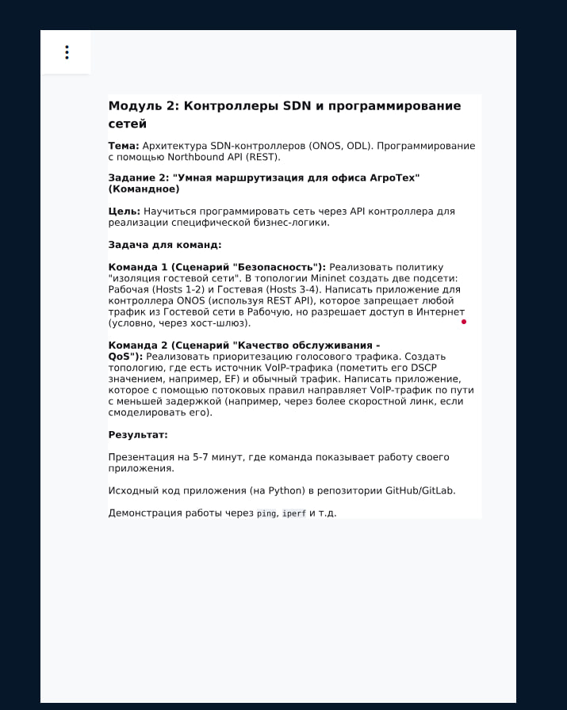

# В чём суть?


1 команда выполнялась Вадимом

2 команда Саматом

# 1 команда
Директория - `./first`

`securityApp.py` - основное приложение. Использует правила из `ruleManager.py`.

Перед запуском убедиться, что запущен контейнер с образом `onosproject/onos:latest` с параметрами по умолчанию.

Команда запуска: `docker run -d --name onos -p 8181:8181 -p 8101:8101 -p 5005:5005 -p 6653:6653 onosproject/onos:latest`

Также установите необходимые зависимости:
```bash
python3 -m venv .venv
source .venv/bin/activate # .venv/Scripts/activate для windows
pip install -r requirements.txt
```

После этого можно запускать `securityApp.py` из терминала

Для очистки информации по портам (в особенности при перезапусках):
`sudo mn -c`

Предварительно `mininet` должен быть установлен. [См. оф доку](https://mininet.org/download/)

## DoD
1. `h1` и `h2` могут пинговать друг друга
2. `h3` и `h4` могут пинговать друг друга
3. `h1` и `h3` НЕ могут пинговать друг друга
4. `gw` могут пинговать все устройства
5. `gw` может пинговать все устройства

# 2 команда

Директория - `./second`

`speedApp.py` - основное приложение. Использует правила из `ruleManager.py`.

Перед запуском убедиться, что запущен контейнер с образом `onosproject/onos:latest` с параметрами по умолчанию.

Команда запуска: `docker run -d --name onos -p 8181:8181 -p 8101:8101 -p 5005:5005 -p 6653:6653 onosproject/onos:latest`

Также установите необходимые зависимости:
```bash
python3 -m venv .venv
source .venv/bin/activate # .venv/Scripts/activate для windows
pip install -r requirements.txt
```

После этого можно запускать `speedApp.py` из терминала

Для очистки информации по портам (в особенности при перезапусках):
`sudo mn -c`

Предварительно `mininet` должен быть установлен. [См. оф доку](https://mininet.org/download/)

## DoD
1. `h1 ping -c 5 h2` - ~5мс (VoIP трафик)
2. `h3 ping -c 5 h4` - ~40мс (Обычный трафик)
